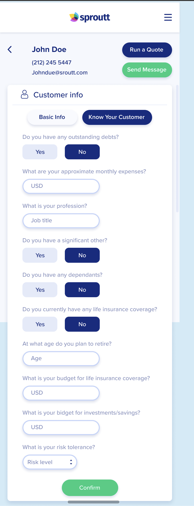
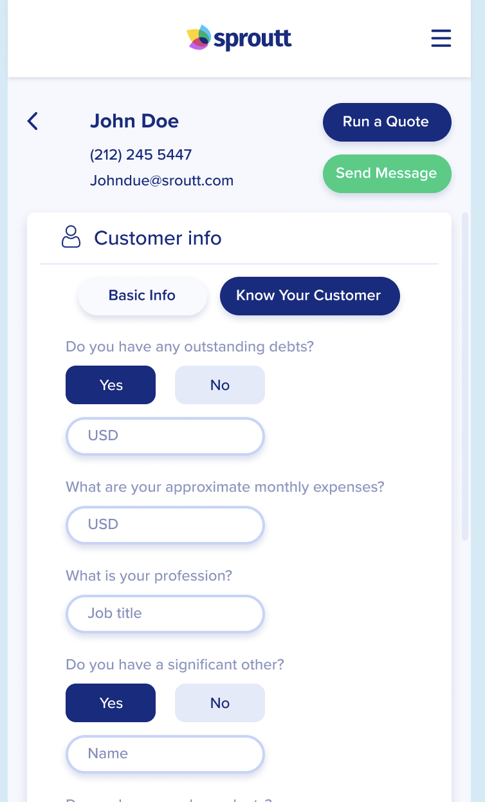

# Know your customer assignment

## Description:

Sproutt's SmartLife Pro application is used by our agents to manage their customers and offer them the best life insurance policy.

Each customer has a Customer Card that is used by the agent to manage the customer.

The Customer Card contains the customer's personal information, policy details, and health information.

We'd like to add **"Know your customer"** section to the Customer Card.

This section will include a dynamic questionnaire (questions and answers, שאלון) that will be presented to the agent when he opens the Customer Card.

This data will be later processed and using AI we'll be able to predict the best policy for the customer.

The questionnaire might vary and **change over time** and should be **dynamic**.

You are invited to the technical design meeting and need to present the backend solution, including Architecture, business logic and data Modeling.

FE will need to work in coordination with you to implement the UI. thus you will need to explain FE>BE flow.

You will need to implement the solution in code after the design meeting.


## Functional requirements:

1. The questionnaire should be maintainable and might change over time (new questions, new followups, etc.).
2. The questionnaire should be presented to the Agent when he opens the Customer Card.
3. Each question can have a **different type**, currently supporting:
   ```
   1. Text
   2. Number
   3. Yes/No
   4. Single selection from options (dropdown)
   ```
4. Each question can have **multiple followups** (other questions that will be presented based on the answer, **>1**).
5. Each question can have **only single answer** (on a dropdown - only **one item** can be selected).
6. When agent answers questions for customer, the answers should be **saved and presented** to the agent when he opens the Customer Card again.


**Example of questionnaire:**
```
q1: "At what age do you plan to retire?" (Number).

q2: "Do you currently have any life insurance coverage?" (Yes/No).
    q2.1: If yes, "What is the type of life insurance" (Dropdown: Term, Whole Life, UL, IUL, VUL, Other).
    q2.2: If yes, "What is the amount" (Number).
    q2.3: If no, "What is the amount you are looking for?" (Number).
  
q3: "Do you have any dependents?" (Yes/No) .
    q3.1: If Yes: "Does any of your dependents have a chronic disease?" (Yes/No).
        q3.1.1: If Yes: "Which chronic disease does your dependent have?" (Dropdown: Diabetes, Heart Disease, Cancer, Other).
```

## Requirements:

High to low priority:
```
1. Working API/s (can be mocked).
2. Data modeling, including DB schema.
3. Code - business logic (functions, classes, etc).
4. Support persistence of answers (Agent got back to same Customer card).
5. Tests
```

Assumptions:
1. **DB access & DB exists** (DB layer is already in place and working). mimic DB response using mocks in code.
2. **WebServer exists**, you can mimic REST, etc using function names or comments on code

## Notes:
1. You can implement it in any language you desire.
2. Focus is on **design, data modeling, logic** and not on the specific code / tricks.
3. We'd like example from above to work using mocks (mock DB in your code)
4. If you have extra time - can add DB layer, HTTP Server, REST layer, etc.

**Questionnaire:**



**Followups:**

